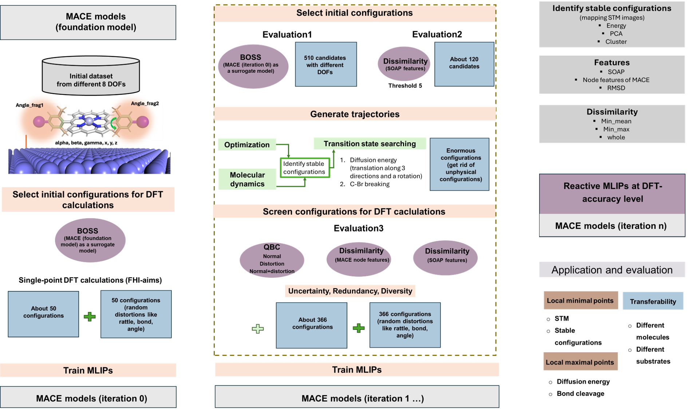

# Active_learning_MLIPs


<!-- Badges -->
[](https://doi.org/10.1021/jacs.4c14757)
[](LICENSE)
[](https://github.com/Meganwu/AutoOSS_nanonis)
[](https://YOURDOC.readthedocs.io/en/latest/?badge=latest)
[](https://doi.org/10.5281/zenodo.13761822)
[](https://github.com/Meganwu/Active_MLIP_surf/releases/tag/v1.0.0)


---



# 📑 Table of Contents
- [About](#about)
- [Features](#features)
- [Installation](#installation)
- [Quick Start](#quick-start)
- [Documentation](#documentation)
- [Releases](#releases)
- [Citation](#citation)
- [License](#license)


# About Active_MLIP_surf


Given the structures of a molecule and a surface, the software Active_MLIP_surf can automatedly generate efficient training dataset and train machien learning interatomic potential (MLIP) models (based on MACE) to construct accurate reactive MLIPs. It enables to search stable configurations among enormous configration spaces and recognize corresponding 3D structures based on STM images, transition state (espeically for C-X bond and diffusion energy).


## Project Structure

```

.
├── Images
├── LICENSE
├── README.md
├── foundation_model
├── run_train_mace.py
├── separate_configs
├── step1_boss_generate_iter0
├── step2_select_data_from_boss_iter0
├── step3_generate_aims_input_iter0
├── step4_iter1
├── step5_boss_generate_iter1
├── step6_select_data_from_boss_iter1
├── step7_md_and_opt
├── step888_test_all_neb_md_opt
├── step8_cal_final_sim
├── step9_cal_neb_sim
├── step10_filter_soap
├── step11_filter_mace
├── step12_filter_qbc
├── step13_select_and_generate_aims
├── step14_iter2
├── step15_boss_generate_iter2
└── utils

```


# Installation


# Step 1 take a foundation model of MACE as the surrogate model of BOSS, randomly generate 50 initial dataset based on torsion angles and distance of molecules away from the surface. (sample grids by BOSS) and generate a random rattle configurations for each one
(example: ZnBr2Me4DPP majorly two flexible torsion angle, 3 translational free degrees, 3 rorational free degrees, 8 in total)


# Step2  Train MLIPs (based on Mace here)
## from scratch
## refine from the foundation model
### Selected
### Distortion
### Selected + Distortion


# Step3  Generate more configurations based on MLIPs
## a. BOSS  (random from all degrees of freedom, more on molecules close to surfaces, more on surfaces)
## b. MACE optimization  (C-H at most less than 2.5, C-Br less than 2.0) (using PCA and cluster techniques to get rid of high similar stable configurations)
## C. MACE molecular dynamics
## d. NEB for breaking C-Br bonds by using selected stable configuraitons (from b) as the initial configurations
Plus
## e. randomly creat distorsions by changing bonds or angles from some inital configurations


# Step4 Evaluate these configurations
## Similarity
  !### RMSD (atomic positions n:3) 
  !### Similarity like SSIM and Cosine based on fingerprints (mace model node feature n: 640)
  !### QBC

  ### whole molecules  (filter 1)
  ### element-wise feature in a molecule (filter 2)
  ### QBC (selected, distortion and both) (filter 3)


  

### choose 50. all  in top 150 of three methods
### Randomly distort these 50 configs by distortions on rattle, bond, and angle.


# Step5 Construct new training dataset from step4


# Step6 Evaluate the performance of MLIPs
## STM images
## Optimization
## Diffusion energy


